# Sapiens Shifter

The app is available on TestFlight. Try it out before October 25, 2025!

<a href="https://www.figma.com/design/NndlnxrOODw170AugPWby5/Sapiens-Shifter?node-id=0-1&p=f">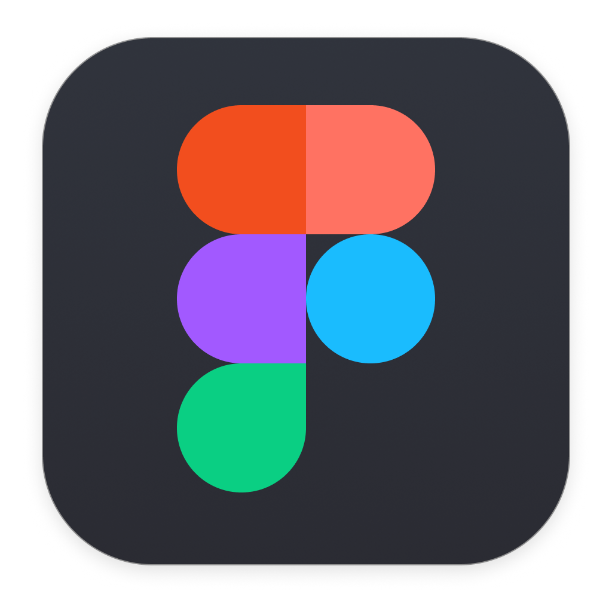</a>
Project design file

### Splash, Onboard, Sign In

  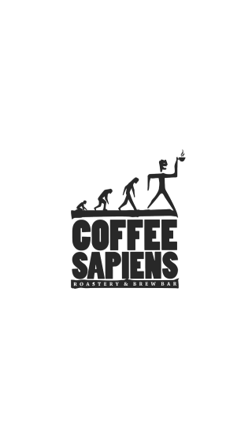
  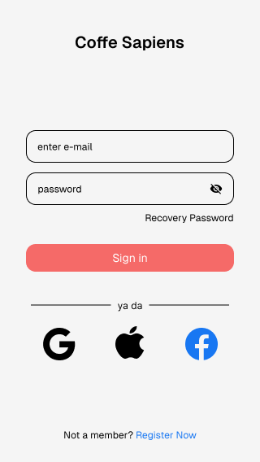
  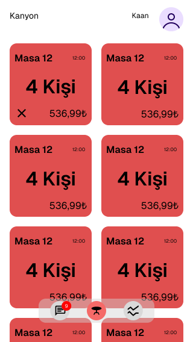
  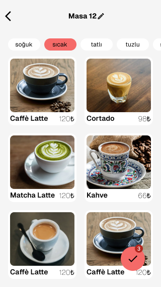
  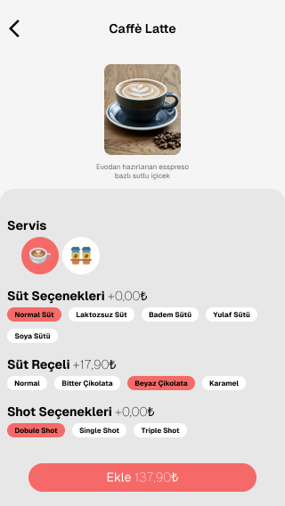
   
  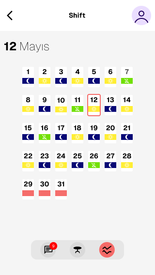
  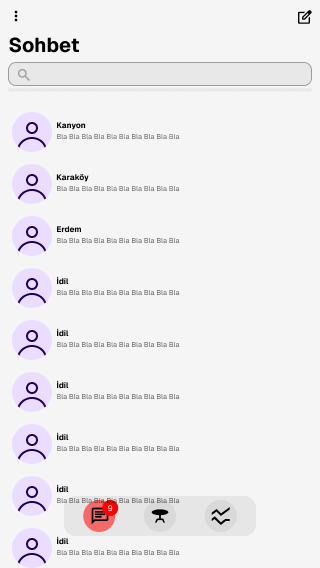
  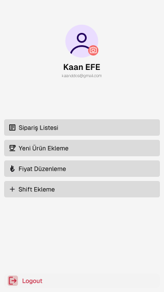
  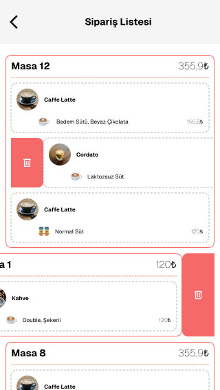
  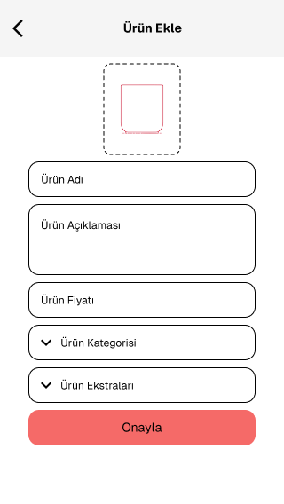

## What is it?
I built this application for the coffee shop where I previously worked. It enables staff to view and manage their shift schedules, communicate internally via chat, and handle customer orders through a lightweight interface. After showcasing the app to several peers, the feedback was consistent — it has strong potential to be adapted for use across various types of businesses. I share this perspective, but scaling and productionizing the solution would require collaboration beyond a solo effort.

## Technologies Used
- **Flutter** – Cross-platform framework for building iOS and Android applications  
- **Firebase Firestore** – Cloud-hosted NoSQL database for real-time data management  
- **Firebase Storage** – For storing media and other user-generated content  
- **Firebase Cloud Messaging (FCM)** – For sending push notifications to users  
- **Firebase Cloud Functions** – For serverless backend logic and notification automation
> Note: The app is primarily built using Firebase technologies, but its modular architecture allows for easy replacement with alternative services if needed.

## My Mobile Project Journey: Lessons Learned and Future Horizons
As I developed this application, my goal was to gain experience and mastery over every single stage. User experience (UX) and user interface (UI) are absolutely crucial for users, and since I'm not a designer, I took inspiration from several existing designs, which I've referenced at the end of the file.

Once the design was complete, I started contemplating how to code it. For a developer, workflow is arguably even more important than writing the code itself. I can code a page, but I needed to consider all possible scenarios, where to begin, the general tools to be used in the application, localization, widgets, and the internal states of those widgets. All of these elements need to be individually analyzed, planned, and documented. This process incredibly speeds up your development. For some pages, after I'd done this planning, I was able to complete them within a single day. At times, though, I spent days on a simple widget, revising it repeatedly. Towards the end of the development process, the errors I encountered were mostly due to my handling of these scenarios. Even now, some pages still have workflow-related issues. Initially, I aimed to create a flawless first version, but that's not possible with my current knowledge and time, primarily because I can't self-finance.

While developing the application, I also tried to use artificial intelligence efficiently. I didn't just tell it, "Make this page," and leave all the work to it. For example, I needed to copy data from one collection to another in the database and then delete it from the original collection. I was aware of Firebase's batch and transaction concepts, but I wasn't an expert. Instead of asking AI to "do this for me," I'd say something like, "I need to perform an operation like this, and I think batch or transactions might be suitable. Can you explain both in detail?" I'd then thoroughly learn the differences and similarities between them and code it myself the first time. However, I prefer to do similar tasks with the help of AI afterward.

During the development process, I also gained some insights into teamwork. When dividing tasks, having a standard is definitely important, and this needs to be documented. For example, one person might write a class for HTTP requests, another might build widgets, and yet another might develop the pages. The workflow for the person coding the pages would be to send requests and organize the incoming responses according to the widgets on the page. Let's say a user wants to fetch and list people. The friend handling HTTP requests created a class called "users," but when listing people, only their name and photo are sufficient because the widget designer didn't customize the widget according to the User class – and doing so would have been wrong, as the page designer might use that widget on different pages. In situations like this, where three people are working on different tasks, they need to act in a coordinated manner. Actively using Git is very beneficial here; features should be tested on different branches and then merged with pull requests.

Speaking of testing, I realized how crucial it is. For instance, when writing HTTP requests, we designed a workflow. We'd request information for a user and then perform certain actions based on the incoming response. For example, if the person's name is Kaan, we'd set their "handsomeness" to true in our custom class; for others, it would be false. On the backend, there are three possibilities: first, Kaan comes, and handsomeness is true; second, someone else comes, and handsomeness is false; and third, a null value comes. Let's say our code simply checks the first two cases with a basic if statement. But what happens if the third scenario occurs? This is precisely where we need to use unit tests. All possible scenarios should be considered, tested, and then actions should be taken accordingly, all while adhering to the application's overall design pattern. Returning to our scenario, we performed our test and sent null data to our method. When writing the method, we hadn't decided what to do if the data came back null. Flutter threw an error itself, which is incorrect behavior. It terminates the method's flow, creating an impression for the user like "I pressed the button, but nothing happened, I didn't even get an error." We need to handle this situation. If null data comes, we can throw our own error and display it to the user (e.g., "The person you want to view does not exist") or we might not throw an error and simply send an empty user. While not a great user experience, at least the user would understand that the button worked but couldn't reach the desired item. In summary, tests are truly important.

After testing, I understood the necessity of logging. I had no difficulty with notifications. I did encounter errors, but since I knew where the errors originated, I could easily see from the logs whether the notification was sent or not. I could easily see in the logs if the message was sent but the system meant to send it as a notification ("FCM") wasn't working, or if the recipient had simply turned off notifications. Similarly, logging whether a service was started or not within the application as info logs was a huge help during the development process. Although I couldn't fully implement this on the application side, it will definitely be one of my top priorities in new projects.

To summarize everything, this project truly taught me a lot and broadened my vision. When I started the chat feature, I thought, "How hard can it be to make a WhatsApp clone?" I figured it wouldn't be used much, but at least I'd try. Then, as I started thinking about how to do it, I realized there were an incredible number of things I needed to account for, and I had to handle them in a proper and scalable way. For instance, displaying the last message in a chat – I tried three or four different approaches. Some were unnecessary, others incomplete. Even its current state isn't fully scalable, but it's sufficient for a simple application. This experience gave me incredible insight; I understood the extent to which large companies consider every scenario. I realized what an engineering marvel it is to store messages locally, search within them, synchronize, encrypt, and countless other things I can't even list. In short, large companies are large for very strong reasons.

While developing this project, I researched many things I was curious about. There's no end to the topics to learn, but you need to plan this well. Sometimes I found myself thinking, "I really don't know anything," and other times, "Oh, this is easy." I believe the most important thing is knowing where to look and being able to grasp it. Actually, every technological device we use is just zeros and ones, but it's not that simple. The variety of processor architectures stems from a need. I used to think, "People can do it, so they did," but the truth is different. I learned many things I can't fit here. As I said, now I think I need to set sail for new projects.

I want to learn Swift to gain more mastery over the iOS side with Flutter. Additionally, I want to learn Go to get a grasp of the backend. And for my hobby projects, I want to learn embedded systems and C++. I definitely can't do all of this in a short time, but I'm now aware of something I couldn't grasp before: it truly doesn't matter which language you use; they just have their own differences. You need to know which one suits your needs. For embedded systems, since they are very small hardware, managing them with Dart isn't feasible (theoretically possible, but impractical). However, writing embedded systems in languages like C and C++ where you need to manage all hardware yourself is easier. Or, when developing an API on the server side, we need to perform a very large number of parallel operations. Again, you could do it with Dart, but it wouldn't be efficient at all.

## References and Acknowledgements

### References

- [Member registration and login screen (unfortunately removed)](https://dribbble.com/shots/15889044-Login-Register-Mobile-App)
- [Home screen](https://ui8.net/dpopstudio/products/coffeinopia---coffe-shop-app-mobile-ui-ux)
- [Chat screen](https://apps.apple.com/us/app/messages/id1146560473)
- [Shift screen](https://dribbble.com/shots/22106737-Shifter-Mobile-App)
- [Font (Geist)](https://vercel.com/font)

### Acknowledgements

@VB10, also known as Veli BACIK, creates content on [YouTube](https://www.youtube.com/@HardwareAndro) that is very meaningful to me. I’ve watched his videos multiple times — at first, I struggled to understand them, but eventually, I experienced those 'aha' moments. Many of the approaches in this project are outputs I have blended with his ideas. He produces great content for Turkish developers. I especially wanted to thank him for the support he provides to developers in Turkey and for the project he did for [Hatay](https://www.hatayiyasat.com/), which truly deserves great appreciation.
